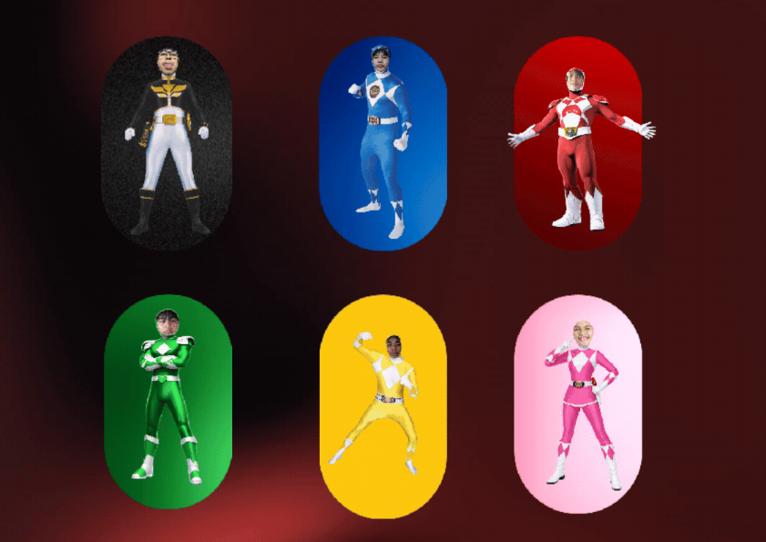

# Gym Exercises

A simple static website built with HTML and CSS as a school project, presented by "EJANDBFF" group.

# Benefits of the website
The primary goal of presenting gym exercises is to provide users with an organized and easy-to-understand resource where they can discover exercises, learn how to perform them correctly, and choose exercises based on specific muscle groups and fitness goals.

# Access via link
https://ejayy17.github.io/gym-exercises/

